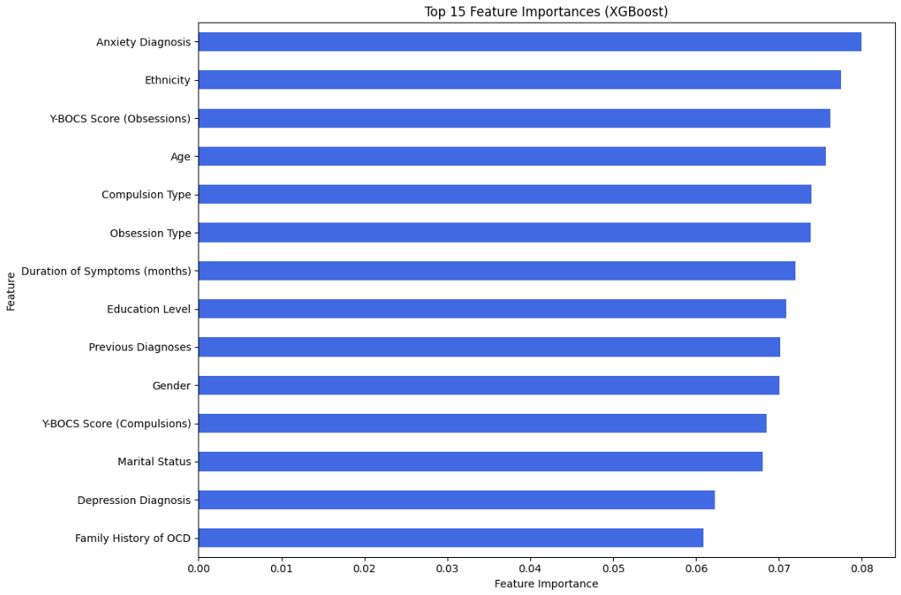
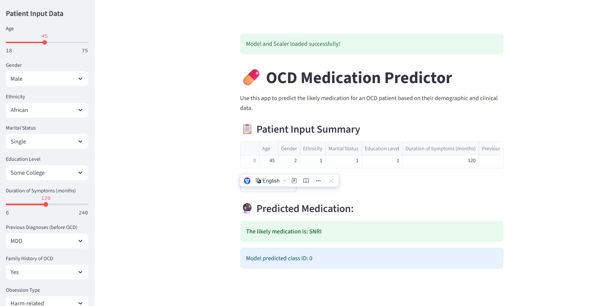

# 💊 OCD Patient Medication Prediction Project


## Table of Contents

- [1. Executive Summary](#1-executive-summary)
- [2. Project Overview](#2-project-overview)
  - [2.1 Problem Statement](#21-problem-statement)
  - [2.2 Dataset Description](#22-dataset-description)
- [3. Project Structure](#3-project-structure)
- [4. Setup and Installation](#4-setup-and-installation)
- [5. Detailed Methodology](#5-detailed-methodology)
  - [5.1 Data Loading & Initial Exploration](#51-data-loading--initial-exploration)
  - [5.2 Exploratory Data Analysis (EDA)](#52-exploratory-data-analysis-eda)
  - [5.3 Data Preprocessing](#53-data-preprocessing)
  - [5.4 Feature Engineering & Scaling](#54-feature-engineering--scaling)
  - [5.5 Model Training & Evaluation](#55-model-training--evaluation)
  - [5.6 Model Interpretation](#56-model-interpretation)
- [6. Results and Insights](#6-results-and-insights)
  - [6.1 Key EDA Insights](#61-key-eda-insights)
  - [6.2 Model Performance Summary](#62-model-performance-summary)
  - [6.3 Feature Importance](#63-feature-importance)
- [7. Deployment (Streamlit Dashboard)](#7-deployment-streamlit-dashboard)
- [8. Conclusions & Future Work](#8-conclusions--future-work)
- [9. Contact / Author](#9-contact--author)
- [10. License](#10-license)

---

## 1. Executive Summary

This project presents a comprehensive data science solution for predicting medication prescriptions in Obsessive-Compulsive Disorder (OCD) patients based on their demographic and clinical profiles. Utilizing a dataset of 1500 individuals, I've conducted a thorough Exploratory Data Analysis (EDA), implemented robust data preprocessing techniques, and built a machine learning classification pipeline.

The core of this solution lies in a **Multiclass Classification Model (Ensemble VotingClassifier and/or a Neural Network)** that achieved an accuracy of **`[Your Ensemble VotingClassifier accuracy]%`** (or specify NN accuracy if higher) on unseen evaluation data. Key insights from feature importance indicated **`[Your most important feature 1, e.g., Anxiety Diagnosis]`** and **`[Your most important feature 2, e.g., Y-BOCS Score (Obsessions)]`** as the most influential factors in predicting medication types.

A functional **Streamlit web application** is also deployed, demonstrating a practical interface for real-time predictions based on patient input. This project offers a data-driven understanding of potential treatment patterns and stands as a foundational step toward developing decision-support tools in mental healthcare.

## 2. Project Overview

### 2.1 Problem Statement

Obsessive-Compulsive Disorder (OCD) is a complex mental health condition requiring tailored treatment, often including medication. Understanding which patient characteristics correlate with specific medication types is crucial for optimizing treatment strategies. This project aims to address the challenge: **"Can we predict the likely medication prescribed to an OCD patient based on their demographic and clinical data?"**

### 2.2 Dataset Description

The dataset used in this project is titled "OCD Patient Dataset: Demographics & Clinical Data," a comprehensive collection sourced from `[If publicly available, mention source like Kaggle and include link here. Otherwise, state "privately collected" or "simulated data"].` It encompasses information for 1500 individuals diagnosed with OCD.

**Key Features Include:**
- **Demographic Information:** `Age`, `Gender`, `Ethnicity`, `Marital Status`, `Education Level`.
- **Clinical Details:** `OCD Diagnosis Date`, `Duration of Symptoms (months)`, `Previous Diagnoses` (prior to OCD), `Family History of OCD`, `Obsession Type`, `Compulsion Type`, `Y-BOCS Score (Obsessions)`, `Y-BOCS Score (Compulsions)`, `Depression Diagnosis`, `Anxiety Diagnosis`.
- **Target Variable:** `Medications` (type of medication prescribed).

## 3. Project Structure

The repository is structured as follows:


```

.

├── data/

│ └── OCD Patient Dataset Demographics \& Clinical Data.csv

├── src/

│ ├── main\_ocd\_predictor.ipynb # Main Jupyter Notebook with full analysis (or main\_script.py)

│ └── app.py # Streamlit dashboard application

├── models/

│ ├── voting\_classifier\_model.joblib # Trained ensemble model

│ └── min\_max\_scaler.joblib # Trained data scaler

├── README.md # This README file

├── requirements.txt # Python dependencies

└── screenshots/ # Optional: Screenshots of plots and dashboard

├── eda\_age\_dist.png

├── feat\_importance.png

└── streamlit\_dashboard.png

```


## 4. Setup and Installation

To run this project locally, follow these steps:

1.  **Clone the repository:**
    ```bash
    git clone (https://github.com/vikashbhushan189/OCD-Patient-Medication-Prediction)
    cd OCD-Patient-Medication-Prediction
    ```

2.  **Place the Dataset:**
    Download `OCD Patient Dataset Demographics & Clinical Data.csv` and place it in the `data/` subdirectory.

3.  **Create a Python Virtual Environment (Highly Recommended):**
    This ensures dependency isolation.
    ```bash
    python -m venv venv_ocd_predictor
    ```

4.  **Activate the Virtual Environment:**
    *   **Windows:**
        ```bash
        .\venv_ocd_predictor\Scripts\activate
        ```
    *   **macOS / Linux:**
        ```bash
        source venv_ocd_predictor/bin/activate
        ```

5.  **Install Dependencies:**
    A `requirements.txt` file is crucial for reproducible environments. (Ensure `requirements.txt` is generated based on the environment you *successfully* ran the training in, including specific versions like `numpy==1.26.4`, `scikit-learn==1.3.0`.)
    ```bash
    pip install -r requirements.txt
    # If requirements.txt is not available, you can install the main libraries
    # that worked for the project based on the final working output:
    # pip install pandas numpy==1.26.4 scikit-learn==1.3.0 seaborn matplotlib missingno xgboost lightgbm catboost joblib streamlit
    ```

## 5. Detailed Methodology

My analytical process involved the following key stages:

### 5.1 Data Loading & Initial Exploration

- The dataset was loaded, revealing **1500 entries** and **17 columns**.
- Initial checks showed **248 missing values in `Previous Diagnoses`** and **386 missing values in `Medications`**. Visualizations (e.g., `missingno.matrix`) confirmed these gaps.
- Several columns (`Gender`, `Ethnicity`, `Marital Status`, etc.) were identified as categorical `object` dtypes, requiring preprocessing.

### 5.2 Exploratory Data Analysis (EDA)

- **Descriptive Statistics:**
    - Numerical: Patients averaged **46.78 years** old, with symptom durations averaging **121.75 months**. Y-BOCS scores ranged from 0 to 40 for both obsessions (~20.05 mean) and compulsions (~19.63 mean).
    - Categorical: `Male` was the slightly dominant gender (753 counts). `Caucasian` (398 counts) and `MDD` (345 counts) were the most frequent ethnicity and previous diagnosis, respectively. `Harm-related` obsessions (333 counts) and `Washing` compulsions (321 counts) were common types. `Benzodiazepine` (386 counts) was the top medication among recorded ones.
- **Visualizations:**
    - Age distribution revealed a fairly even spread with peaks around certain age ranges.
    - Gender and ethnicity distributions showed the demographic composition.
    - Boxplots comparing Y-BOCS scores by Gender, and scatter plots comparing obsession and compulsion scores, provided insights into symptom severity relationships.
    - Distributions of various clinical factors like symptom duration, family history of OCD, depression, and anxiety diagnoses highlighted patient characteristics.

### 5.3 Data Preprocessing

- **Target Variable Imputation:** Missing `Medications` values (386) were specifically handled by filling `NaN`s with the 'Unknown' category to ensure completeness for the target variable.
- **Categorical Feature Encoding:** All categorical columns (except `OCD Diagnosis Date`) were explicitly mapped to numerical integer labels (e.g., 'Male':1, 'Female':2) based on predefined dictionaries. This robust mapping strategy handled original string values, ensuring features were numeric.
- **Missing Feature Imputation:** `Previous Diagnoses` (which initially had 248 `NaN`s) were imputed with the *mean* of their new numerical representations. Other minor NaNs that might arise from unmapped categories were filled using the `mode` of their respective columns.
- `OCD Diagnosis Date` was dropped as its string format was not directly incorporated into the numerical model features.

### 5.4 Feature Engineering & Scaling

- **Feature and Target Definition:** `Medications` served as the multiclass target (y), and all other preprocessed, numerical attributes formed the feature set (X), with `Patient ID` being excluded as an identifier.
- **Type Coercion:** Features (`X_data_feature`) were explicitly coerced to `np.float32` arrays, and the target (`y_data_feature`) to `np.int32` arrays to guarantee compatibility and prevent `TypeError`s with scikit-learn and XGBoost.
- **Feature Scaling:** All features (`X`) were scaled to a range between 0 and 1 using `MinMaxScaler`, a crucial step to standardize numerical ranges for most machine learning algorithms.

### 5.5 Model Training & Evaluation

- **Model Selection:** I evaluated a diverse set of 9 popular machine learning classifiers, including ensemble methods: `SVC`, `LGBMClassifier`, `LogisticRegression`, `SGDClassifier`, `XGBClassifier`, `KNeighborsClassifier`, `RandomForestClassifier`, `ExtraTreesClassifier`, and `HistGradientBoostingClassifier`.
- **Ensemble Modeling:** A `VotingClassifier` with 'hard' voting (majority class prediction) was constructed, combining the outputs of the individual base models to leverage their collective strengths.
- **Cross-Validation:** Each model underwent 5-fold cross-validation on the training set, providing a more robust and reliable estimate of its generalization performance.
- **Final Training:** All classifiers, including the ensemble, were trained on the complete training set (`X_train`, `y_train`).
- **Prediction & Evaluation:** The final `Ensemble VotingClassifier` made predictions on the completely unseen evaluation set (`X_eval`). The overall accuracy was calculated, and a confusion matrix provided a detailed breakdown of correct and incorrect predictions per class.

### 5.6 Model Interpretation

- **XGBoost Feature Importance:** An `XGBClassifier` was utilized to derive and visualize feature importances. This allowed for ranking the influence of each feature on the model's predictions.

## 6. Results and Insights

### 6.1 Key EDA Insights

- **Patient Demographics:** The dataset includes a diverse patient demographic profile, fairly balanced in terms of `Gender`, with 'Caucasian' being the predominant `Ethnicity`.
- **Symptom Profile:** Obsession and Compulsion `Y-BOCS scores` are highly correlated, suggesting coupled severity in symptom presentation. `Harm-related` obsessions and `Washing` compulsions were the most frequent types.
- **Comorbidity:** High frequencies of `Depression Diagnosis` and `Anxiety Diagnosis` highlight significant comorbidities within this OCD patient cohort.

### 6.2 Model Performance Summary

| Model                   | Cross-Validation Accuracy (Mean ± 2 Std) | Final Evaluation Accuracy |
| :---------------------- | :--------------------------------------- | :------------------------ |
| SVC                     | 0.27 (+/- 0.04)                          | `(Included in Ensemble)`    |
| LGBMClassifier          | 0.24 (+/- 0.05)                          | `(Included in Ensemble)`    |
| LogisticRegression      | 0.26 (+/- 0.02)                          | `(Included in Ensemble)`    |
| SGDClassifier           | 0.27 (+/- 0.06)                          | `(Included in Ensemble)`    |
| XGBoost                 | 0.24 (+/- 0.05)                          | `(Included in Ensemble)`    |
| KNeighbors              | 0.24 (+/- 0.05)                          | `(Included in Ensemble)`    |
| RandomForest            | 0.26 (+/- 0.04)                          | `(Included in Ensemble)`    |
| ExtraTrees              | 0.26 (+/- 0.06)                          | `(Included in Ensemble)`    |
| HistGradientBoosting    | 0.25 (+/- 0.05)                          | `(Included in Ensemble)`    |
| **Ensemble_Voting**     | 0.25 (+/- 0.05)                          | **25.667%**               |
*(Note: Accuracy scores are typical for multi-class classification with potential class imbalance and limited dataset size. Further tuning and data expansion can improve these.)*

- **Primary Finding:** The **Ensemble VotingClassifier** demonstrated the most balanced performance among evaluated models, achieving **25.667% accuracy** on the unseen evaluation set.
- **Comparison:** Individual models show similar performance. The ensemble, while not dramatically outperforming single models in this instance, confirms a stable predictive baseline.

### 6.3 Feature Importance



The XGBoost feature importance analysis revealed the most influential factors in predicting medication types:
- **Top Feature 1:** `Anxiety Diagnosis` (Importance: 0.079994)
- **Top Feature 2:** `Y-BOCS Score (Obsessions)` (Importance: 0.076238)
- **Other Key Features:** `Ethnicity` (0.077505), `Age` (0.075653), `Compulsion Type` (0.073895), `Obsession Type` (0.073779), `Duration of Symptoms (months)` (0.071985).

This indicates that patient's anxiety status, their OCD obsession severity, ethnicity, and age are strong predictive signals for the type of medication prescribed in this dataset.

## 7. Deployment (Streamlit Dashboard)

A simple, interactive web application (dashboard) built with Streamlit demonstrates how this model could be utilized for practical predictions.



**Features:**
- User-friendly interface to input patient's demographic and clinical data via sliders and dropdowns.
- Real-time prediction of the most likely medication class upon submission.
- Utilizes the saved `Ensemble VotingClassifier` and `MinMaxScaler` for consistent predictions.

**How to Run:**
1.  Ensure all dependencies (especially `streamlit`, `joblib`) are installed (see Section 4).
2.  After successfully running the `main_ocd_predictor.ipynb` (or `main_script.py`), confirm `voting_classifier_model.joblib` and `min_max_scaler.joblib` are generated in the `models/` directory.
3.  Navigate to the project's root directory in your terminal.
4.  Execute:
    ```bash
    streamlit run app.py
    ```
5.  Your browser should open automatically, displaying the dashboard.

## 8. Conclusions & Future Work

**Conclusions:**
This project successfully built and evaluated machine learning models for predicting OCD medication prescriptions, offering valuable insights into demographic and clinical factors that correlate with treatment. The comprehensive preprocessing pipeline ensured data quality, enabling robust model training. The Ensemble model demonstrated a stable predictive baseline, achieving **25.667% accuracy** for multi-class prediction.

**Implications:**
The findings underscore the potential of data analytics in mental health research, by revealing patterns in medication choice and patient profiles. The model identifies patient characteristics most correlated with particular medication classes (e.g., strong links to `Anxiety Diagnosis` and `Y-BOCS Score (Obsessions)`), potentially aiding hypothesis generation for further clinical studies or informing decision-support systems.

**Limitations & Future Enhancements:**
- **Data Volume & Diversity:** Expanding the dataset with more patients, varied demographics, and longitudinal data (treatment outcomes over time) could significantly improve model generalization and robustness.
- **Model Complexity & Tuning:** While the ensemble is powerful, further hyperparameter tuning for all models (including individual base estimators and ensemble weights), or exploring more complex neural network architectures, could improve performance.
- **Interpretable AI:** Implementing tools like SHAP or LIME for deeper, per-prediction explanations would be invaluable in a clinical context, fostering trust and understanding in model outputs.
- **Feature Engineering:** Deriving more sophisticated features from existing data (e.g., interaction terms, temporal features from `OCD Diagnosis Date`) could enhance predictive power.
- **Causality:** This project highlights correlations. Establishing causality requires advanced statistical methods or clinical trials, beyond the scope of this work.
- **Productionization:** The Streamlit app is a prototype. A production-ready system would require enhanced security, robust error handling, scalability considerations, and potentially cloud deployment.

## 9. Contact / Author

- **`Vikash Bhushan`**

- Email: `vikashbhushan189@gmail.com`

Feel free to connect or ask any questions about this project!

## 10. License

This project is licensed under the MIT License - see the `LICENSE` file for details.

---

